# Design Guidelines - Overlay AI

## Table of Contents

1. [Quick Reference](#quick-reference)
2. [Introduction & Project Context](#introduction--project-context)
3. [Design Philosophy & Core Principles](#design-philosophy--core-principles)
4. [Accessibility Guidelines (WCAG 2.1 AA)](#accessibility-guidelines-wcag-21-aa)
5. [Glass Morphism Design System](#glass-morphism-design-system)
6. [Color & Contrast Guidelines](#color--contrast-guidelines)
7. [Typography Guidelines](#typography-guidelines)
8. [Component Design Patterns](#component-design-patterns)
9. [Real-Time Interface Design](#real-time-interface-design)
10. [Keyboard & Hotkey Design](#keyboard--hotkey-design)
11. [State Management & Feedback](#state-management--feedback)
12. [Animation Guidelines](#animation-guidelines)
13. [Responsive & Adaptive Design](#responsive--adaptive-design)
14. [Best Practices for Overlay Windows](#best-practices-for-overlay-windows)
15. [Testing & Validation](#testing--validation)
16. [Future Enhancements](#future-enhancements)

---

## Quick Reference

### Design Cheat Sheet

#### Essential Colors

```yaml
Primary Accent:
  Base: #6366f1
  Light: #818cf8
  Dark: #4f46e5

Status Colors:
  Success: #10b981
  Warning: #f59e0b
  Error: #ef4444
  Neutral: rgba(255, 255, 255, 0.3)

Speaker Colors:
  Interviewer: #60a5fa
  User: #34d399
```

#### Text Hierarchy

```
Primary (95%):   Headlines, important content
Secondary (70%): Body text, labels
Muted (50%):     Secondary info, hints
Subtle (35%):    Decorative, metadata
```

#### Common Dimensions

```
Window:
  Normal: 400px × 450px
  Compact: 340px × 350px
  Minimized: 280px × 120px

Components:
  Header height: 40px
  Button min: 28px × 28px
  Touch target: 44px × 44px
```

#### Key Hotkeys

```
Cmd+Shift+L: Toggle Live Mode
Cmd+Shift+X: Generate Answer
Cmd+Shift+Z: Clear Overlay
Cmd+Shift+M: Toggle Minimize
```

#### Animation Durations

```
Fast: 150ms - Micro-interactions
Medium: 250ms - Standard transitions
Slow: 400ms - Major transitions
```

#### Contrast Requirements

```
Normal text: 4.5:1 minimum
Large text: 3:1 minimum
UI components: 3:1 minimum
```

---

## Introduction & Project Context

### Project Overview

Overlay AI is a **cross-platform desktop application** built with Electron, React, and a Rust native audio engine. It functions as a **stealth overlay window** that floats above other applications, designed specifically to remain invisible to screen capture software (Zoom, Teams, OBS) while being fully visible to the user.

### Primary Use Case

The application is specifically designed for **technical interviews**, providing real-time assistance during:

- Coding interviews
- System design discussions
- Technical Q&A sessions

### Target Users

**Technical job candidates** participating in remote technical interviews who want discreet assistance by:

- Listening to the conversation in real-time
- Maintaining context of the last 20 minutes
- Generating intelligent, context-aware answers when triggered
- Remaining hidden from interviewers via screen sharing

### Key Constraints

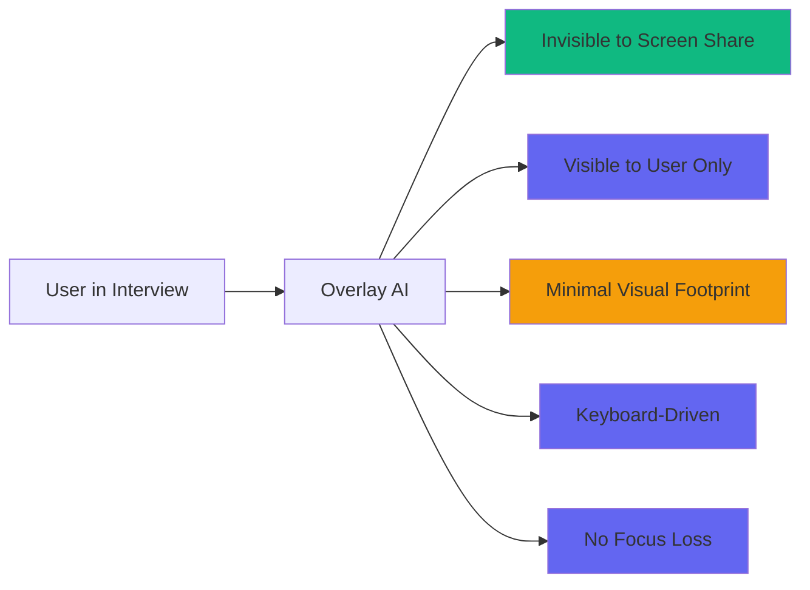

### Technical Architecture

**Frontend/UI:**

- React 18 with TypeScript 5.4
- Vite 5.1 build tool
- Tailwind CSS 3.4 with glass morphism
- Streamdown for streaming markdown

**Desktop Framework:**

- Electron 29+
- Rust audio engine (cpal + ScreenCaptureKit)
- IPC via electron-trpc

**External Services:**

- Deepgram Nova-2 (transcription)
- Groq SDK (LLM)

### Current Project Status

**Completed Features:**

- Core audio capture (Rust)
- Deepgram transcription integration
- Context buffer (20-minute rolling window)
- Groq LLM integration
- Glass morphism UI system
- All 12 UI components
- Global hotkey system
- Stealth window implementation
- Settings/configuration

**Key Files Referenced:**

- `tailwind.config.js` - Design system configuration
- `src/renderer/components/Header.tsx` - Header implementation
- `src/renderer/components/LiveTranscript.tsx` - Transcript display
- `src/renderer/components/AnswerCard.tsx` - AI response display
- `src/renderer/components/StatusIndicator.tsx` - Status visualization
- `src/renderer/styles/index.css` - Custom CSS and animations

---

## Design Philosophy & Core Principles

### 1. Stealth & Minimalism

**Principle**: The interface should be visible only to the user, invisible to screen capture.

**Implementation Guidelines:**

- Use platform-specific screen capture exclusion APIs
- Minimal chrome - only essential elements visible
- No decorative elements that draw unnecessary attention
- Subtle animations that enhance rather than distract

**Reference**: `tailwind.config.js` - Glass color system with low-opacity backgrounds (rgba values 0.05-0.15)

### 2. Focus on Essentials

**Rationale**: Limited screen real estate requires prioritization of information.

**Application:**

- Show only necessary information at any given time
- Hide advanced features until needed
- Progressive disclosure for complex settings
- Prioritize content over chrome

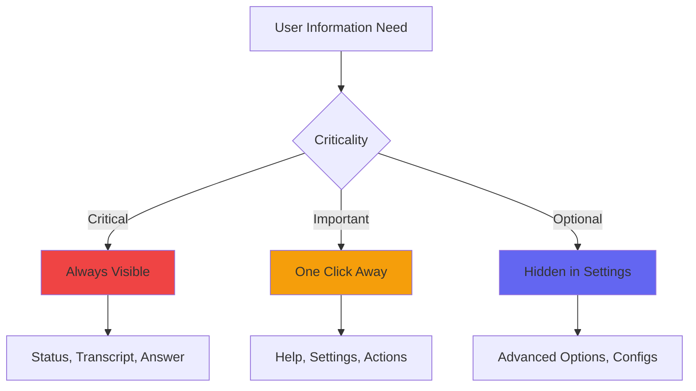

**Example**: Minimized mode shows only status and last transcript segment

### 3. Real-Time Responsiveness

**Principle**: Immediate feedback for all user actions and streaming data.

**Guidelines:**

- **Streaming Content**: Handle incremental text updates gracefully
- **Latency Targets**:
  - Transcription: < 1s
  - Answer generation: < 2s
  - UI updates: < 100ms
- **Visual Feedback**: Show loading/saving states immediately

### 4. Keyboard-First Design

**Principle**: Keyboard interaction is primary, mouse is secondary.

**Guidelines:**

- **Global Hotkeys**: Work without application focus
- **No Focus Loss**: Hotkeys don't steal focus from other apps
- **Alternative Input**: Mouse interaction available but not required
- **Logical Mappings**: Memorable hotkey combinations

### 5. Context Awareness

**Principle**: The system maintains and utilizes conversation context effectively.

**Guidelines:**

- **Rolling Buffer**: Maintain configurable conversation history (default 20 minutes)
- **Speaker Identification**: Differentiate interviewer vs. user visually
- **Intelligent Responses**: Generate answers based on full context
- **Relevance Scoring**: Prioritize recent context

---

## Accessibility Guidelines (WCAG 2.1 AA)

### Contrast Requirements

**WCAG 2.1 AA Compliance:**

- **Normal Text (< 18pt)**: Minimum 4.5:1 contrast ratio
- **Large Text (≥ 18pt or ≥ 14pt bold)**: Minimum 3:1 contrast ratio
- **UI Components**: 3:1 minimum for graphical objects and user interface components

**Text Hierarchy Implementation:**

| Level     | Opacity | Usage                        | Contrast Ratio |
| --------- | ------- | ---------------------------- | -------------- |
| Primary   | 95%     | Headlines, important content | ~14:1 ✓        |
| Secondary | 70%     | Body text, labels            | ~8:1 ✓         |
| Muted     | 50%     | Secondary information, hints | ~5.5:1 ✓       |
| Subtle    | 35%     | Decorative, background info  | ~3.5:1 ✓       |

**Contrast Validation:**

```
Element: Primary text on deep background
Foreground: rgba(255, 255, 255, 0.95)
Background: rgba(15, 15, 20, 0.85)
Contrast: ~14:1 ✓ (Passes WCAG AA)

Element: Code text on dark background
Foreground: #818CF8
Background: rgba(0, 0, 0, 0.3)
Contrast: ~6:1 ✓ (Passes WCAG AA)

Element: Accent buttons
Foreground: #818CF8
Background: Transparent
Contrast: ~5:1 ✓ (Passes WCAG AA)
```

**Testing Tools:**

- WebAIM Contrast Checker
- Colour Contrast Analyser (CCA)
- Chrome DevTools Lighthouse

### Focus Visibility

**Requirement**: Visible keyboard focus indicator on all interactive elements.

**Implementation:**

- Platform default focus styles preferred
- Custom focus indicators: 2-3px borders or outlines
- Focus must remain visible until element loses focus
- Focus indicators must not be time-limited

**Focus States:**

```mermaid
stateDiagram-v2
    [*] --> Default: No focus
    Default --> Focus: Tab or click
    Focus --> Hover: Mouse hover while focused
    Focus --> Active: Space/Enter/Click
    Active --> Focus: Release
    Hover --> Focus: Mouse leave
    Focus --> Default: Tab away or blur
```

**Reference**: `src/renderer/components/Header.tsx` - Header button hover and focus states

**Focus Style Requirements:**

- **Default**: No outline or subtle outline
- **Hover**: Subtle background change (rgba(255, 255, 255, 0.08))
- **Focus**: 2px solid accent color (#6366f1) or platform default
- **Focus+Hover**: Slight brightness increase on focus ring

### Text Resizing

**Requirement**: Support up to 200% text scaling without content loss or functionality loss.

**Implementation Guidelines:**

- Use relative units (rem, em, %) instead of fixed pixels
- Avoid fixed-width containers that break when text expands
- Use `max-width` instead of fixed `width` for text containers
- Ensure overflow handling (scrollbars) is functional at all sizes

**Layout Considerations:**

- Fluid layouts that adapt to text scaling
- Proper overflow handling for content areas
- Text containers resize when text resizes
- No content clipping or truncation at 200% scale

**Reference**: `src/renderer/styles/index.css` - Fluid typography implementation

### ARIA Landmarks

**Region Role**: Identify significant content areas for screen reader navigation.

**Labeling Requirements:**

- Every landmark must have an accessible name
- Use `aria-label` for self-labeling elements
- Use `aria-labelledby` for labels from visible text
- Prefer semantic HTML elements (section) over ARIA roles

**Live Regions:**

- `aria-live="polite"` for status updates and transcript
- `aria-live="assertive"` for error messages
- `aria-busy="true"` for loading/generating states
- `aria-atomic="true"` for complete updates as a unit

**Reference**: `src/renderer/components/LiveTranscript.tsx` - Scrollable content area with proper roles

### Color Independence

**Principle**: Never rely solely on color to convey information.

**Implementation:**

- Always pair color with:
  - Icons
  - Text labels
  - Patterns (dashed borders, etc.)
  - Textual descriptions

**Examples:**

- Status indicators use both color (green/red/amber) AND text labels
- Speaker differentiation uses color AND speaker labels
- Error states use color AND icon AND text message

**Accessibility Checklist:**

- [ ] All interactive elements have visible indicators beyond color
- [ ] Charts/graphs use patterns or labels, not just colors
- [ ] Error messages include descriptive text
- [ ] Form validation shows both color and text feedback

---

## Glass Morphism Design System

### Design Philosophy

**Concept**: Multi-layered transparency creating depth and hierarchy through:

- Semi-transparent backgrounds
- Backdrop blur effects
- Subtle borders and shadows
- Gradient overlays for depth

**Benefits:**

- Works on variable and unknown backgrounds
- Provides modern, premium aesthetic
- Subtle visual hierarchy without harsh borders
- Maintains readability while adding visual interest

### Background Layers

**Depth Hierarchy:**

```
┌─────────────────────────────────────────────────────────────┐
│ LAYER 0: Deep Background                                 │
│ rgba(15, 15, 20, 0.85)                                 │
│ → Highest opacity, darkest tone                            │
│ → Base layer for entire application                         │
├─────────────────────────────────────────────────────────────┤
│ LAYER 1: Primary                                         │
│ rgba(255, 255, 255, 0.05)                                │
│ → Base layer for cards and panels                          │
│ → Subtle transparency for content areas                    │
├─────────────────────────────────────────────────────────────┤
│ LAYER 2: Secondary                                       │
│ rgba(255, 255, 255, 0.08)                                │
│ → Elevated content, headers                               │
│ → Slightly more opaque for emphasis                       │
├─────────────────────────────────────────────────────────────┤
│ LAYER 3: Elevated                                        │
│ rgba(255, 255, 255, 0.10)                                │
│ → Interactive elements, hover states                      │
│ → Noticeable elevation from background                    │
├─────────────────────────────────────────────────────────────┤
│ LAYER 4: Hover                                           │
│ rgba(255, 255, 255, 0.12)                                │
│ → Button and interactive hover states                      │
│ → Clear visual feedback for interaction                   │
├─────────────────────────────────────────────────────────────┤
│ LAYER 5: Active                                          │
│ rgba(255, 255, 255, 0.15)                                │
│ → Pressed/selected states                                │
│ → Highest opacity for strong emphasis                    │
└─────────────────────────────────────────────────────────────┘
```

**Reference**: `tailwind.config.js` - Glass color system (lines 7-43)

### Backdrop Blur System

**Levels and Usage:**

| Level       | Blur Amount | Usage                              |
| ----------- | ----------- | ---------------------------------- |
| Small       | 8px         | Subtle cards, non-critical content |
| Medium      | 16px        | Standard panels, modals            |
| Large       | 24px        | Main content areas, headers        |
| Extra Large | 40px        | Full-screen overlays, modals       |

**Platform Considerations:**

- macOS: Full blur support, best performance
- Windows: Variable blur support, test performance
- Linux: Limited blur support, provide fallback

**Reference**: `tailwind.config.js` - backdropBlur configuration (lines 58-63)

### Border Management

**Purpose**: Edge definition without harsh, distracting lines.

**Hierarchy:**

| Border Type | Opacity | Usage                             |
| ----------- | ------- | --------------------------------- |
| Subtle      | 8%      | Inner content borders, separators |
| Default     | 12%     | Standard element borders          |
| Strong      | 18%     | Important emphasis, active states |

**Accent Borders:**

- Gradient overlays for special attention
- Top border gradients for headers and cards
- 1-2px height for subtle emphasis

**Reference**: `tailwind.config.js` - Border colors (lines 40-42)

### Gradient Overlays

**Effect**: Subtle radial gradients for depth and visual interest.

**Positions:**

- **Top-left accent**: Indigo glow at 20% horizontal, 0% vertical
- **Bottom-right accent**: Purple glow at 80% horizontal, 100% vertical

**Implementation:**

```css
radial-gradient(ellipse at 20% 0%, rgba(99, 102, 241, 0.08) 0%, transparent 50%),
radial-gradient(ellipse at 80% 100%, rgba(139, 92, 246, 0.06) 0%, transparent 50%)
```

**Opacity**: 6-8% for subtle effect

**Reference**: `src/renderer/styles/index.css` - `.glass-container::before` (lines 39-47)

### Noise Texture

**Purpose**: Adds realism and depth to glass surfaces.

**Implementation:**

- SVG filter with fractal noise
- Base frequency: 0.8
- Number of octaves: 4
- Opacity: 1.5% - minimal but noticeable

**CSS Implementation:**

```css
background-image: url("data:image/svg+xml,%3Csvg viewBox='0 0 256 256'...");
opacity: 0.015;
```

**Reference**: `src/renderer/styles/index.css` - `.glass-container::after` (lines 49-56)

### Shadow System

**Elevation Levels:**

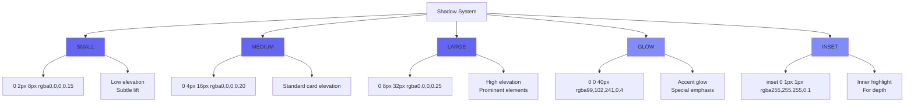

**Reference**: `tailwind.config.js` - boxShadow configuration (lines 51-57)

---

## Color & Contrast Guidelines

### Dark-Only Palette Rationale

**Context**: The overlay must work on unknown, variable backgrounds.

**Solution**: Dark theme optimized for readability on any background.

**Guidelines:**

- **Avoid**: Pure black (#000000) - too harsh
- **Preferred**: Near-black (#0F0F14) with slight warmth
- **Test**: Validate against light, dark, and mixed backgrounds
- **Adapt**: Ensure glass effects provide sufficient contrast

### Accent Color System

**Primary Accent - Indigo:**

```yaml
Base: #6366f1
Light: #818cf8
Dark: #4f46e5
Glow: rgba(99, 102, 241, 0.4)
Subtle: rgba(99, 102, 241, 0.15)
```

**Usage:**

- Interactive elements (buttons, links)
- Status indicators (active states)
- Accents and highlights
- Brand identity elements

**Status Colors:**

```yaml
Success: #10b981 (Emerald green)
Warning: #f59e0b (Amber)
Error: #ef4444 (Red)
Neutral: rgba(255, 255, 255, 0.3)
```

**Usage:**

- Connection states
- Validation feedback
- Error messages
- Status badges

**Reference**: `src/renderer/components/StatusIndicator.tsx` - Status configuration (lines 17-41)

**Speaker Colors:**

```yaml
Interviewer: #60a5fa (Blue)
User: #34d399 (Green)
```

**Usage:**

- Speaker labels in transcript
- Color-coded text segments
- Visual differentiation in UI

**Reference**: `src/renderer/components/LiveTranscript.tsx` - Speaker configuration (lines 20-29)

### Text Hierarchy System

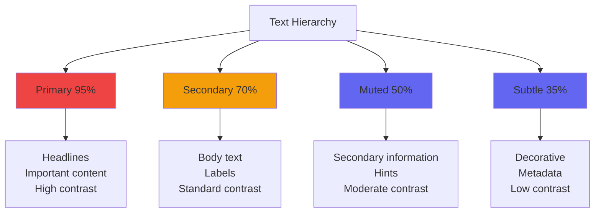

**Examples:**

- Primary: "Overlay AI" logo, section headings, AI response titles
- Secondary: Transcript content, answer body, form labels
- Muted: Status labels, helper text, timestamps
- Subtle: Metadata, decorative elements, background patterns

### Color Contrast Validation

**Testing Process:**

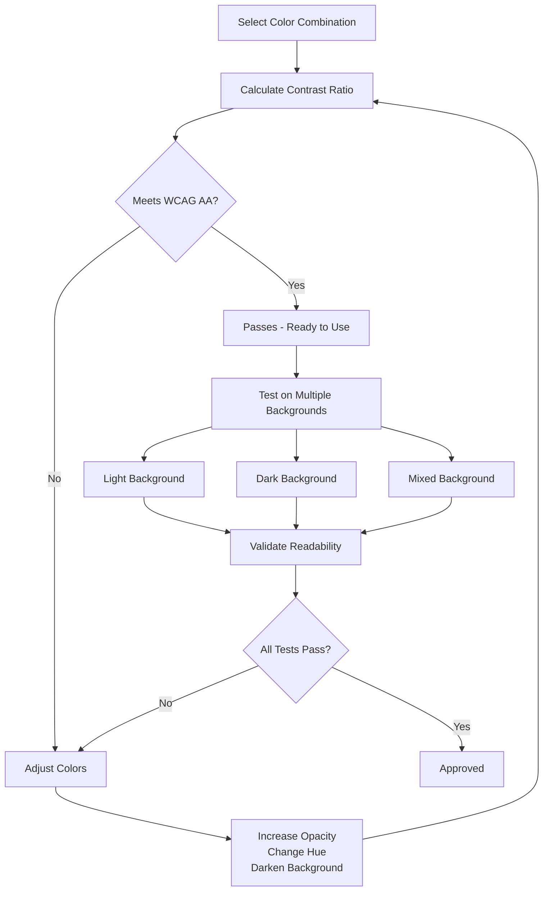

**Pass Criteria:**

- WCAG AA: 4.5:1 (normal), 3:1 (large)
- WCAG AAA: 7:1 (recommended for high importance)
- Multiple backgrounds: Test on at least 3 different backgrounds

**Regular Auditing:**

- Test against light, dark, and photo backgrounds
- Validate with different screen brightness settings
- Test with color blindness simulators
- Use automated tools for initial validation

### Gradient & Overlay Guidelines

**Gradient Types:**

- **Top Accent Gradients**: Use for header emphasis and card tops
- **Bottom Fade Gradients**: For scrolling content indicators
- **Radial Gradients**: Subtle glow effects, not primary focus

**Implementation Guidelines:**

- Maximum 2-3 gradient layers to avoid visual clutter
- Keep opacity low (6-8%) for subtle effect
- Use `pointer-events: none` for overlay elements
- Ensure gradients don't interfere with content readability

**Reference**: `src/renderer/styles/index.css` - Gradient implementations (lines 39-97)

---

## Typography Guidelines

### Font System

**Primary Font - Inter:**

```yaml
Purpose: UI elements, body text, labels
Weights: 300 (Light), 400 (Regular), 500 (Medium), 600 (SemiBold), 700 (Bold)
Usage: All interface text except code
Rationale: Highly legible, designed for screens, excellent variable font support
Source: Google Fonts - https://fonts.googleapis.com/css2?family=Inter:wght@300;400;500;600;700
```

**Secondary Font - JetBrains Mono:**

```yaml
Purpose: Code blocks, technical content, monospace labels
Weights: 400 (Regular), 500 (Medium), 600 (SemiBold)
Usage: Inline code, code blocks, monospace tags
Rationale: Excellent code readability, distinct from sans-serif
Source: Google Fonts - https://fonts.googleapis.com/css2?family=JetBrains+Mono:wght@400;500;600
```

**Reference**: `src/renderer/styles/index.css` - Font imports (line 2)

### Size Scale

| Scale | Size | Usage                |
| ----- | ---- | -------------------- |
| XS    | 10px | Tags, badges, labels |
| SM    | 11px | Small UI text        |
| Base  | 13px | Body text, default   |
| MD    | 15px | Emphasized body text |
| LG    | 18px | Small headings       |
| XL    | 22px | Medium headings      |
| 2XL   | 26px | Large headings       |

**Implementation:**

- Base size: 13px for most body text
- Use relative units (rem/em) for scalability
- Maintain consistent scale progression (1.2-1.3 ratio)
- Support 200% scaling via relative units

### Typography Best Practices

**Line Height:**

- Body text: 1.5 for optimal readability
- Headings: 1.3 for tighter, impactful look
- Code: 1.6 for line alignment

**Letter Spacing:**

- Normal: 0 (default) - body text, UI elements
- Wide: 0.05em - uppercase labels, tracking
- Tight: -0.02em - dense content, rarely used

**Paragraph Spacing:**

- Between paragraphs: 1em (relative to font size)
- After headings: 0.75em
- Before headings: 1.5em

**Max Line Length:**

- Optimal: 80 characters for readability
- Maximum: 100 characters before wrapping
- Minimum: 40 characters for comfortable reading

**Fluid Typography:**

- Support 200% scaling via relative units (rem/em)
- Test content at 150% and 200% zoom
- Ensure layout doesn't break at larger sizes
- Use `max-width` containers with `overflow` handling

### Code Typography

**Inline Code:**

```css
Font: JetBrains Mono, 90% of body size
Background: rgba(255, 255, 255, 0.1)
Border: 1px solid rgba(255, 255, 255, 0.08)
Padding: 3px 7px
Color: #818cf8 (accent light)
Radius: 5px
```

**Code Blocks:**

```css
Font: JetBrains Mono, 13px
Background: rgba(0, 0, 0, 0.3)
Border: 1px solid rgba(255, 255, 255, 0.08)
Padding: 18px
Line Height: 1.6
Top Accent: Gradient highlight (#6366f1 to transparent)
```

**Reference**: `src/renderer/styles/index.css` - Code styling (lines 227-255)

### Markdown Typography

**Headings:**

| Level | Size   | Weight | Usage               |
| ----- | ------ | ------ | ------------------- |
| H1    | 1.3em  | 600    | Main headings       |
| H2    | 1.15em | 600    | Section headings    |
| H3    | 1.05em | 600    | Subsection headings |

**Lists:**

- **Unordered**: Indigo markers (#6366f1), 1em margin, 0.5em between items
- **Ordered**: Semi-transparent white markers, monospace font
- **Nested**: Indent 1.5em per level

**Blockquotes:**

- Left border: 3px solid #6366f1
- Background: rgba(255, 255, 255, 0.08)
- Text: Italic, 70% opacity
- Padding: 14px 18px
- Border radius: 0 8px 8px 0

**Links:**

- Color: #818cf8 (accent light)
- Hover: #6366f1 (accent base) with underline
- Transition: 150ms ease
- External links: Open in new tab with rel="noopener noreferrer"

**Reference**: `src/renderer/styles/index.css` - Markdown prose styling (lines 189-302)

---

## Component Design Patterns

### Component Architecture

**Design Patterns:**

- **Composition Pattern**: Components built from smaller, reusable parts
- **Container/Presentational**: State managed in hooks, components purely presentational
- **Icon System**: Factory pattern for consistent SVG rendering
- **Single Responsibility**: Each component has one clear purpose

**Benefits:**

- Reusability across the application
- Easier testing and maintenance
- Consistent styling and behavior
- Clear separation of concerns

### Header Component

**Purpose**: Top navigation and window controls

**Dimensions**: Height 40px, full width

**Elements:**

- Logo (26x26px) with gradient background
- Application name (13px semibold)
- Status badge (live connection state)
- Action buttons (4 icons: Help, Settings, Minimize, Close)

**Layout:**

```
┌──────────────────────────────────────────────────────┐
│ [🔷] Overlay AI  [● LISTENING]  [?] [⚙] [─] [✕] │
│ Logo   Name      Status      Help Set Min Close     │
└──────────────────────────────────────────────────────┘
  ↑                        ↑
  Drag region              Non-drag buttons
```

**Draggable Region:**

- Header area: `-webkit-app-region: drag`
- Buttons: `-webkit-app-region: no-drag`
- Visual feedback: `move` cursor on drag area

**Reference**:

- `src/renderer/components/Header.tsx` - Header implementation
- `src/renderer/styles/index.css` - Draggable regions (lines 28-34)

### Live Transcript Component

**Purpose**: Display real-time conversation transcript

**Dimensions**: Max height 240px (configurable)

**Features:**

- 60-second rolling window
- Speaker grouping and color coding
- Interim text styling
- Auto-scroll to latest content
- Empty state with placeholder

**Section Structure:**

```
┌──────────────────────────────────────────────────┐
│ ● LIVE TRANSCRIPT                  15 segments │ ← Header bar
├──────────────────────────────────────────────────┤
│ INT: Tell me about your experience...           │
│                                                  │
│ YOU: I have 5 years of experience...            │ ← Scrollable
│     working with React and TypeScript.           │   content area
│                                                  │
│ INT: That's interesting. What about...          │
│     backend development?                         │
│     And I've also worked with... (typing...)│ ← Interim text
└──────────────────────────────────────────────────┘
  Fade gradient at bottom
```

**Interim Text Styling:**

- Opacity: 50% (reduced from normal)
- Style: Italic
- Cursor: Blinking 2px vertical bar at end
- Updates: Can change rapidly as speech continues

**Reference**: `src/renderer/components/LiveTranscript.tsx` - Lines 95-107

### Answer Card Component

**Purpose**: Display AI-generated responses

**Dimensions**: Max height 200px (configurable)

**States:**

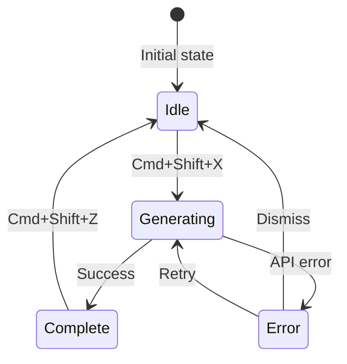

**State Descriptions:**

1. **Idle**: Ready state with instructions
   - Display: Helpful instructions and keyboard shortcut hint
   - Interaction: Waiting for user to trigger generation

2. **Generating**: Loading spinner with streaming content
   - Display: Bouncing dots, streaming markdown content
   - Interaction: Can be cancelled with Escape key

3. **Complete**: Full response with markdown rendering
   - Display: Fully rendered markdown, model badge
   - Interaction: Content can be scrolled and copied

4. **Error**: Error message with retry option
   - Display: Error icon, descriptive message, retry button
   - Interaction: Retry or dismiss

**Section Structure:**

````
┌──────────────────────────────────────────────────┐
│ [⌘] RESPONSE  ● GENERATING  ● ModelName       │ ← Header
├──────────────────────────────────────────────────┤
│ Here's a comprehensive answer to your...        │
│                                                  │
│ ## Background                                    │ ← Markdown
│ Based on our discussion about...                 │   content
│                                                  │
│ ```javascript                                    │
│ const solution = () => {                         │
│   return answer;                                 │
│ };                                              │
│ ```                                             │
│                                                  │
│ Additionally, I recommend... (typing...)│        │
└──────────────────────────────────────────────────┘
````

**Reference**: `src/renderer/components/AnswerCard.tsx`

### Status Indicator Component

**Purpose**: Visual representation of system states

**States and Visuals:**

| State        | Color           | Animation | Label      |
| ------------ | --------------- | --------- | ---------- |
| Disconnected | Gray (neutral)  | None      | OFFLINE    |
| Connecting   | Amber (warning) | Ping      | CONNECTING |
| Connected    | Green (success) | Pulse     | LISTENING  |
| Error        | Red (error)     | None      | ERROR      |

**Animation Patterns:**

**Pulse (connected):**

```css
0%, 100%: opacity 0.4, scale 1
50%: opacity 0.7, scale 1.15
```

- Duration: 2s
- Easing: ease-in-out
- Iteration: infinite

**Ping (connecting):**

```css
0%: scale 1, opacity 0.6
100%: scale 2.2, opacity 0
```

- Duration: 1.5s
- Easing: ease-out
- Iteration: infinite

**Reference**: `src/renderer/components/StatusIndicator.tsx`

### Settings Modal Component

**Purpose**: Configuration interface

**Elements:**

- API key inputs with password toggle
- Custom system prompt textarea
- Save/Cancel actions
- Modal backdrop with blur

**Security Considerations:**

- Password masking for API keys (••••••••••••)
- Encrypted storage using electron-store
- Show/hide toggle for verification
- No plain-text logging of credentials

**Modal Pattern:**

```
┌─────────────────────────────────────────────┐
│ ┌─────────────────────────────────────┐   │
│ │ ━━━━━━━━━━━━━━━━━━━━━━━━━━━━ │   │ ← Accent line
│ │  [Settings]                      │   │
│ ├─────────────────────────────────────┤   │
│ │                                 │   │
│ │  Deepgram API Key               │   │
│ │  [•••••••••••••] 👁️          │   │
│ │                                 │   │
│ │  Groq API Key                  │   │
│ │  [•••••••••••••] 👁️          │   │
│ │                                 │   │
│ │  System Prompt                 │   │
│ │  ┌─────────────────────────┐   │   │
│ │  │ You are a helpful...  │   │   │
│ │  │ interview assistant    │   │   │
│ │  └─────────────────────────┘   │   │
│ │                                 │   │
│ │       [Cancel]    [Save]       │   │
│ └─────────────────────────────────────┘   │
│  ← Backdrop blur, click to close           │
└─────────────────────────────────────────────┘
```

### Modal Pattern Characteristics

- **Backdrop**: Semi-transparent, blurred background
- **Position**: Centered, with max-width constraints
- **Close Mechanisms**:
  - Escape key
  - Click outside modal on backdrop
  - Close button in header
- **Animation**: Slide-up from bottom or fade-in (250ms)

---

## Real-Time Interface Design

### Streaming Content Handling

**Principles:**

- **Incremental Updates**: Render partial content as it arrives
- **Smooth Transitions**: Avoid jarring content jumps
- **Cursor Indication**: Show that content is still streaming
- **Error Recovery**: Gracefully handle connection interruptions

**Streaming States:**

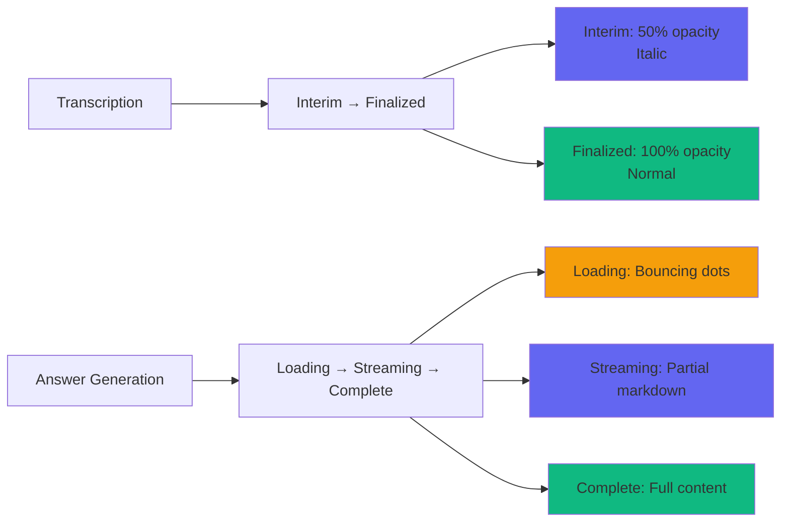

### Interim Text Pattern

**Purpose**: Show unprocessed speech before finalization

**Characteristics:**

- Opacity: 50% of normal text
- Style: Italic
- Cursor: Blinking indicator at end
- Updates: Can change rapidly as speech continues

**Interim Text Flow:**

```
INT: Tell me about your experience with JavaScript...
    (opacity 50%, italic, blinking cursor) ← Interim

INT: Tell me about your experience with JavaScript.
    (opacity 100%, normal, no cursor) ← Finalized
```

**Reference**: `src/renderer/components/LiveTranscript.tsx` - Line 100

### State Transitions

**Live Mode States:**

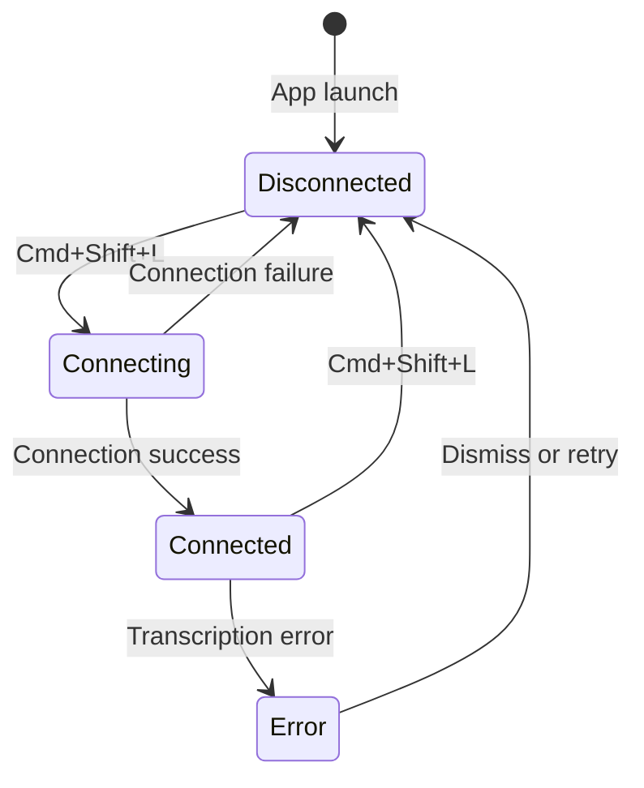

**Visual Feedback:**

| State        | Color           | Animation | Label      |
| ------------ | --------------- | --------- | ---------- |
| Disconnected | Gray (neutral)  | None      | OFFLINE    |
| Connecting   | Amber (warning) | Ping      | CONNECTING |
| Connected    | Green (success) | Pulse     | LISTENING  |
| Error        | Red (error)     | None      | ERROR      |

**Answer Generation States:**


**Reference**: `src/renderer/components/StatusIndicator.tsx` - Status configuration

### Loading State Design

**Spinner Pattern:**

- Size: 20-24px
- Animation: 360deg rotation, 0.8s linear infinite
- Color: Accent or neutral depending on context
- Usage: General loading, connection establishment

**Bouncing Dots Pattern:**

```
●●●  →  ● ●●  →  ●● ●  →  ●●●  (cycling)
```

- Size: 7px diameter
- Spacing: 4px gap
- Animation: Bounce ±8px, 0.6s ease-in-out infinite
- Stagger: 0ms, 150ms, 300ms delays
- Usage: Content loading, streaming initialization

**Reference**: `src/renderer/components/AnswerCard.tsx` - Lines 39-41

### Error Handling

**Types of Errors:**

1. **Connection Errors**: Deepgram/Groq API unreachable
2. **Transcription Errors**: Audio capture failures
3. **Generation Errors**: LLM API errors
4. **Configuration Errors**: Missing or invalid API keys

**Error Display Pattern:**

```
┌─────────────────────────────────────────────┐
│ ⚠️  Generation Failed                  │
│                                          │
│ API request timed out. Please check      │
│ your internet connection and try again.   │
│                                          │
│                [Try Again]              │
└─────────────────────────────────────────────┘
```

**Recovery Options:**

- Retry button (with exponential backoff)
- Link to settings (for configuration errors)
- Helpful error messages with actionable guidance
- Automatic retry queue for transient errors

**Reference**: `src/renderer/components/AnswerCard.tsx` - Lines 50-63

---

## Keyboard & Hotkey Design

### Global Hotkey System

**Primary Hotkeys:**

| Hotkey      | Action           | Purpose                  |
| ----------- | ---------------- | ------------------------ |
| Cmd+Shift+L | Toggle Live Mode | Start/stop audio capture |
| Cmd+Shift+X | Generate Answer  | Send context to LLM      |
| Cmd+Shift+Z | Clear Overlay    | Reset display            |
| Cmd+Shift+M | Toggle Minimize  | Switch to minimal view   |

**Design Principles:**

- **No Focus Loss**: Hotkeys work without switching applications
- **Memorable Patterns**: Consistent prefix (Cmd+Shift)
- **Single-Hand Access**: All keys within reach of left hand
- **Logical Mapping**:
  - L (Live): Toggle live mode
  - X (eXecute): Generate answer
  - Z (Zero): Reset/clear
  - M (Minimize): Toggle minimal view

**Hotkey Conflict Resolution:**

- Check for conflicts before registration
- Allow user customization in future versions
- Show conflicts in settings
- Provide fallback alternatives

### Keyboard Navigation

**Tab Order:**

1. Header buttons (Help, Settings, Minimize, Close)
2. Action buttons in main content
3. Input fields in modals
4. Save/Cancel buttons

**Focus Management:**

- **Visible Indicators**: 2-3px border or outline
- **Skip Links**: Allow jumping to main content
- **Focus Trapping**: Keep focus within modals when open
- **Auto-focus**: Set focus to first interactive element on modal open

**Focus States:**

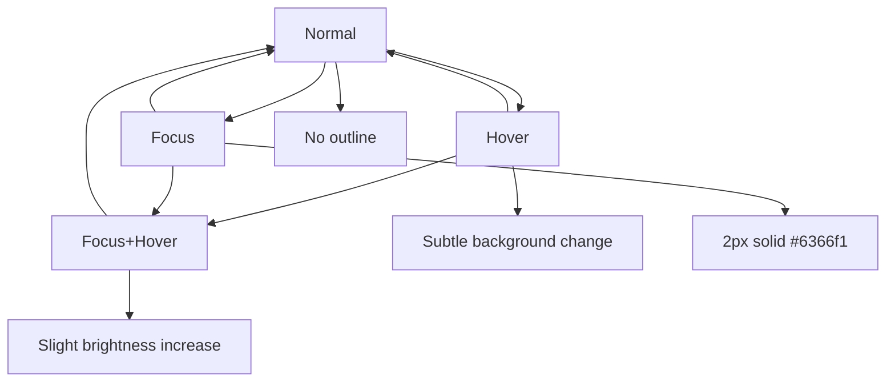

### Escape Key Behavior

**Actions (priority order):**

```mermaid
flowchart TD
    A[Escape Key Pressed] --> B{Modal Open?}
    B -->|Yes| C[Close Modal]
    B -->|No| D{Operation Active?}
    D -->|Yes| E[Cancel Operation]
    D -->|No| F{Overlay Content?}
    F -->|Yes| G[Clear Overlay<br/>(Cmd+Shift+Z)]
    F -->|No| H[Remove Focus]
```

**Priority:**

1. Close modal (if open)
2. Cancel operation (if active generation)
3. Clear overlay content (if applicable)
4. Remove focus from interactive elements

### Alternative Input Methods

**Mouse Interaction:**

- Clickable buttons and controls
- Draggable window regions
- Scrollable content areas
- Hover states for visual feedback

**Touch Considerations:**

- Minimum touch target: 44x44px
- Button spacing: 8px minimum
- Touch-friendly gestures (swipe to dismiss)
- Prevent accidental touches with spacing

---

## State Management & Feedback

### Connection States

**Live Mode State Machine:**

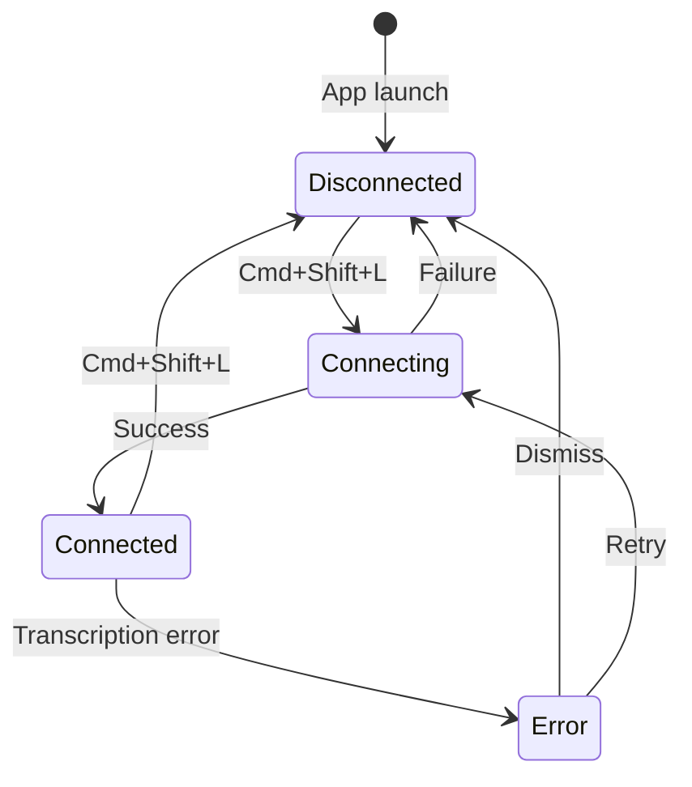

**Visual Feedback:**

| State        | Badge Color     | Animation | Label      |
| ------------ | --------------- | --------- | ---------- |
| Disconnected | Gray (neutral)  | None      | OFFLINE    |
| Connecting   | Amber (warning) | Ping      | CONNECTING |
| Connected    | Green (success) | Pulse     | LISTENING  |
| Error        | Red (error)     | None      | ERROR      |

**Reference**: `src/renderer/components/StatusIndicator.tsx`

### Generation States

**Answer State Machine:**


**Loading States:**

- **Idle**: Instructions, keyboard shortcut hint
- **Generating**: Bouncing dots, streaming content
- **Complete**: Full content, model badge
- **Error**: Error message, retry option

**Reference**: `src/renderer/components/AnswerCard.tsx`

### Configuration States

**States:**

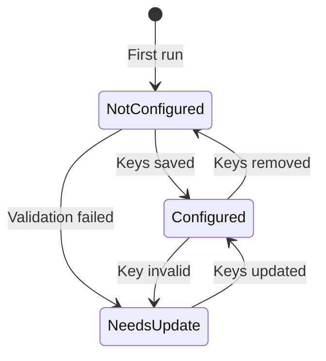

**Visual Feedback:**

- **Warning Banner**: Displayed when not configured
- **Settings Highlight**: Draw attention to configuration
- **Success Indicator**: Confirmation toast after save

**Configuration Flow:**

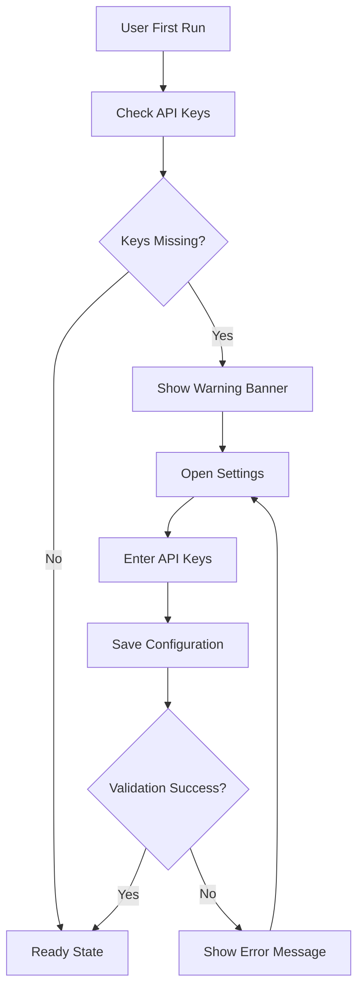

### User Notifications

**Toast Notifications:**

- **Purpose**: Non-intrusive alerts
- **Position**: Top-right or top-center
- **Duration**: 3-5 seconds auto-dismiss
- **Types**: Success, Warning, Error, Info
- **Animation**: Slide-in from top, fade out

**Toast Structure:**

```
┌─────────────────────────────────────┐
│ ✓ Settings saved successfully      │
└─────────────────────────────────────┘
```

**Inline Messages:**

- **Purpose**: Contextual feedback
- **Position**: Near related element
- **Persistence**: Until issue resolved or dismissed
- **Usage**: Form validation, operation status

---

## Animation Guidelines

### Animation Principles

**Purpose-Driven Animations:**

- Enhance feedback
- Guide attention
- Reduce cognitive load
- Communicate state changes

**Performance Guidelines:**

- Use transforms (translate, scale, rotate)
- Avoid layout thrashing (properties that trigger layout)
- Prefer CSS animations over JavaScript
- Test on low-end devices

**Accessibility:**

- Respect `prefers-reduced-motion` media query
- Provide non-animated alternatives
- Don't use animation for critical information
- Keep animations subtle and brief (< 500ms typically)

### Animation Duration Scale

| Duration       | Purpose              | Usage                                |
| -------------- | -------------------- | ------------------------------------ |
| 150ms (Fast)   | Micro-interactions   | Button states, checkbox toggle       |
| 250ms (Medium) | Standard transitions | Modal open/close, dropdown show      |
| 400ms (Slow)   | Major transitions    | Page transitions, complex animations |

**Reference**: `tailwind.config.js` - Transition durations (lines 106-110)

### Easing Functions

**Recommendations:**

- **Ease-out**: For entrances (fade-in, slide-up)
- **Ease-in**: For exits (fade-out, slide-down)
- **Ease-in-out**: For complex transitions
- **Linear**: For continuous animations (spin)

**When to Use Each:**

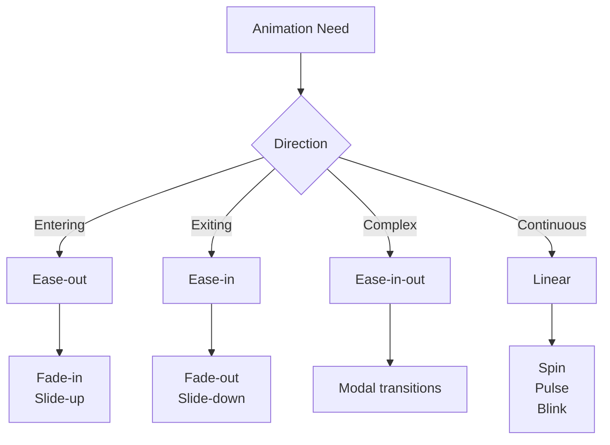

### Animation Types

**1. Pulse (glass-pulse):**

```css
0%, 100%: opacity 0.4, scale 1
50%: opacity 0.7, scale 1.15
```

- Duration: 2s
- Easing: ease-in-out
- Iteration: infinite
- Usage: Connected status indicator

**2. Ping (glass-ping):**

```css
0%: scale 1, opacity 0.6
100%: scale 2.2, opacity 0
```

- Duration: 1.5s
- Easing: ease-out
- Iteration: infinite
- Usage: Connecting status indicator

**3. Blink (glass-blink):**

```css
0%, 50%: opacity 1
51%, 100%: opacity 0
```

- Duration: 1s
- Easing: step-end
- Iteration: infinite
- Usage: Cursor, interim text indicator

**4. Spin (glass-spin):**

```css
0%: rotate 0deg
100%: rotate 360deg
```

- Duration: 0.8s
- Easing: linear
- Iteration: infinite
- Usage: Loading spinner

**5. Bounce (glass-bounce):**

```css
0%, 100%: translateY(0)
50%: translateY(-8px)
```

- Duration: 0.6s
- Easing: ease-in-out
- Iteration: infinite
- Usage: Loading dots (with staggered delays)

**6. Fade-in (glass-fade-in):**

```css
from: opacity 0
to: opacity 1
```

- Duration: 0.2s
- Easing: ease-out
- Usage: Content appearance

**7. Slide-up (glass-slide-up):**

```css
from: opacity 0, translateY(12px)
to: opacity 1, translateY(0)
```

- Duration: 0.3s
- Easing: ease-out
- Usage: Modal appearance, new content

**Reference**: `tailwind.config.js` - Keyframes and animations (lines 68-105)

### Animation Best Practices

**Performance:**

- Use `transform` and `opacity` only (composite-safe properties)
- Avoid `width`, `height`, `margin`, `padding` (trigger layout)
- Use `will-change` sparingly
- Test on low-end devices

**Composition:**

- Combine multiple animations for complex effects
- Use animation delays for sequential animations
- Stagger elements for natural feel
- Keep animations subtle

**Reduction:**

```css
@media (prefers-reduced-motion: reduce) {
  *,
  *::before,
  *::after {
    animation-duration: 0.01ms !important;
    animation-iteration-count: 1 !important;
    transition-duration: 0.01ms !important;
  }
}
```

---

## Responsive & Adaptive Design

### Size Modes

**Normal Mode:**

- Width: 400px
- Height: 450px
- Usage: Full-featured interface
- State: Default view

**Compact Mode:**

- Width: 340px
- Height: 350px
- Usage: Reduced space requirements
- State: Manual toggle or auto-adjust

**Minimized Mode:**

- Width: 280px
- Height: 120px
- Usage: Minimal footprint
- State: Last transcript segment + status

### Mode Transition

**Content Adaptation:**

```
Normal Mode (400x450px):
┌────────────────────────┐
│ Header               │
├────────────────────────┤
│ Config Warning       │
├────────────────────────┤
│ Live Transcript      │
│ (60s window)         │
├────────────────────────┤
│ Answer Card          │
│ (full markdown)      │
└────────────────────────┘

Minimized Mode (280x120px):
┌────────────────────────┐
│ Header [●]          │
├────────────────────────┤
│ INT: ...experience   │
│ with React... (typing)│
└────────────────────────┘
```

**Transition Animation:**

- Duration: 250ms
- Easing: ease-in-out
- Properties: width, height, opacity
- Smooth layout updates during transition

### Scroll Areas

**Custom Scrollbars:**

```css
Width: 6px (thin, unobtrusive)
Track: Transparent
Thumb: rgba(255, 255, 255, 0.12), rounded 3px
Thumb Hover: rgba(255, 255, 255, 0.5)
```

**Reference**: `src/renderer/styles/index.css` - Lines 146-167

**Scroll Behavior:**

- **Auto-scroll**: Follow newest content by default
- **Manual scroll**: User can pause auto-scroll by interacting with scrollbar
- **Scroll indicators**: Fade gradients at edges to indicate more content
- **Smooth scrolling**: Use CSS scroll-behavior: smooth

### Adaptive Content

**Content Prioritization:**

```mermaid
graph TD
    A[Content Prioritization] --> B[Critical]
    A --> C[Important]
    A --> D[Secondary]
    A --> E[Optional]

    B --> B1[Status indicators]
    B --> B2[Current transcript]
    B --> B3[Active AI response]

    C --> C1[AI response history]
    C --> C2[Error messages]
    C --> C3[Configuration warnings]

    D --> D1[Historical transcript<br/>(60s window)]
    D --> D2[Help text]
    D --> D3[Hints and tips]

    E --> E1[Metadata]
    E --> E2[Decorative elements]
    E --> E3[Advanced options]

    style B fill:#ef4444
    style C fill:#f59e0b
    style D fill:#6366f1
    style E fill:#6366f1
```

**Progressive Disclosure:**

- Show essential content first
- Reveal details on user interaction
- Hide advanced features until needed
- Collapse sections to save space

---

## Best Practices for Overlay Windows

### Window Management

**Z-Index:**

- Always on top of other applications
- Maintain above system notifications
- User can toggle "always on top" in settings

**Positioning:**

- Default: Top-right corner of screen
- Draggable: User can reposition as needed
- Persistence: Remember last position between sessions
- Restore: Return to last position on app launch

**Resizing:**

- Fixed sizes (normal, compact, minimized)
- No custom resizing (maintain aspect ratio)
- Smooth transitions between sizes
- Maintain content readability at all sizes

### Draggable Regions

**Implementation:**

```css
/* Drag area - typically header */
.draggable {
  -webkit-app-region: drag;
}

/* Non-drag areas - buttons, inputs, interactive elements */
.non-draggable {
  -webkit-app-region: no-drag;
}
```

**Visual Feedback:**

- Cursor: `move` on hover over drag area
- Selection: Prevented in drag regions
- Touch: Support touch drag on touch-enabled devices

**Reference**: `src/renderer/styles/index.css` - Lines 28-34

**Layout:**

```
┌──────────────────────────────────────────────┐
│ [Header - Draggable Region]                │
│  Logo + Name + Status + [Buttons - Non-Drag]│
├──────────────────────────────────────────────┤
│                                          │
│  [Content Area - Non-Draggable]            │
│  Allows text selection and scrolling        │
│                                          │
└──────────────────────────────────────────────┘
```

### Frameless Window

**Characteristics:**

- No native window chrome (title bar, borders)
- Custom window controls provided by UI
- Transparent background support
- Rounded corners with custom shadows
- Platform-specific styling

**Window Controls:**

- **Minimize**: Cmd+Shift+M or minimize button
- **Close**: Close button in header (top-right)
- **Resize**: Predefined sizes only (normal/compact/minimized)

**Window States:**

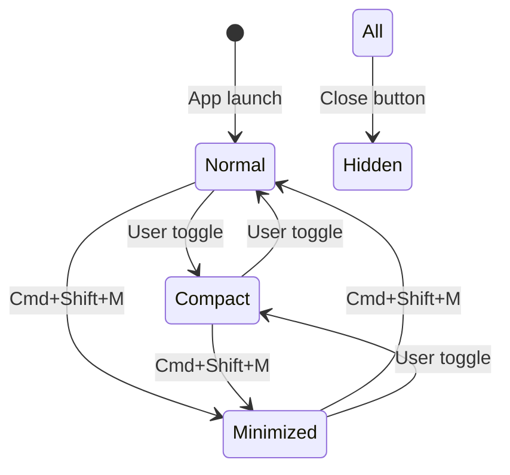

### Screen Capture Invisibility

**Platform-Specific APIs:**

| Platform | API                          | Status          |
| -------- | ---------------------------- | --------------- |
| macOS    | `CGShieldingWindowLevel()`   | Supported       |
| Windows  | `SetWindowDisplayAffinity()` | Supported       |
| Linux    | Wayland layer shell          | Partial support |

**Implementation:**

- Set window level to capture-invisible
- Test against screen recording software
- Verify invisibility to web conference apps
- Provide fallback if platform doesn't support

**Testing Checklist:**

- [ ] macOS Screen Recording
- [ ] macOS Share Screen (Zoom, Teams, Google Meet)
- [ ] Windows Game Bar
- [ ] OBS Studio
- [ ] Linux screen capture tools
- [ ] Various video conferencing platforms

### Transparency & Blending

**Background Transparency:**

- Main window: Transparent
- Content areas: Glass morphism with blur
- Borders: Semi-transparent for subtle definition

**Blur Considerations:**

- **Platform Capability**: macOS > Windows > Linux
- **Fallback**: Reduced blur on unsupported platforms
- **Performance**: Monitor CPU usage with high blur
- **User Control**: Allow disabling blur for performance

**Implementation:**

```css
/* Glass effect with blur */
backdrop-filter: blur(16px);
-webkit-backdrop-filter: blur(16px);
background: rgba(15, 15, 20, 0.85);
```

---

## Testing & Validation

### Contrast Testing

**Tools:**

- WebAIM Contrast Checker: https://webaim.org/resources/contrastchecker/
- Colour Contrast Analyser (CCA): https://www.tpgi.com/color-contrast-checker/
- Chrome DevTools Lighthouse
- axe DevTools extension

**Testing Process:**

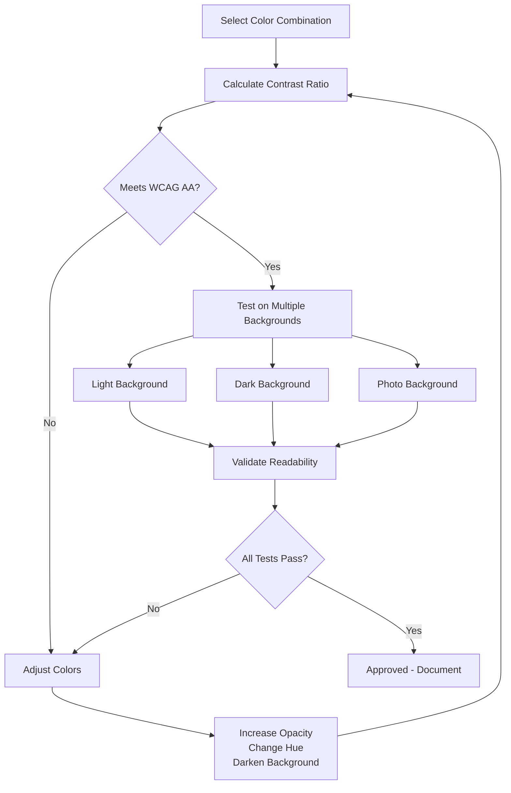

**Pass Criteria:**

- WCAG AA: 4.5:1 (normal), 3:1 (large)
- WCAG AAA: 7:1 (recommended for high importance)
- Multiple backgrounds: Test on at least 3 different backgrounds

**Regular Auditing:**

- Test against light, dark, and photo backgrounds
- Validate with different screen brightness settings
- Test with color blindness simulators
- Use automated tools for initial validation

### Screen Reader Testing

**Platform-Specific Readers:**

- **macOS**: VoiceOver (Cmd+F5)
- **Windows**: NVDA (free), JAWS (commercial)
- **Linux**: Orca

**Testing Checklist:**

- [ ] All interactive elements are announced
- [ ] State changes are announced (connected, generating, error)
- [ ] Navigation follows logical order
- [ ] Region labels are provided
- [ ] Live regions announce updates
- [ ] Form fields have proper labels
- [ ] Buttons have accessible names
- [ ] Images have alt text when needed

**Reference**: `src/renderer/components/LiveTranscript.tsx` - ARIA roles implementation

### Keyboard Navigation Testing

**Test Steps:**

1. **Tab Navigation**: Tab through all interactive elements
2. **Focus Visibility**: Verify focus is visible on each element
3. **Hotkeys**: Test all hotkey combinations
4. **Escape Key**: Verify Escape key behavior
5. **Modal Focus**: Check modal focus trapping
6. **Reverse Tab**: Test Shift+Tab navigation

**Validation:**

- Focus indicators meet contrast requirements
- Logical tab order (reading order)
- No keyboard traps
- All functionality accessible without mouse
- Skip links work for jumping to main content

### Cross-Platform Testing

**Platforms:**

- **macOS 12+**: Primary target platform
- **Windows 10/11**: Secondary platform
- **Linux**: Ubuntu 22.04+, Fedora 35+

**Test Areas:**

- Window positioning and dragging
- Hotkey registration and conflicts
- Screen capture invisibility
- Blur effects (performance and visual)
- Font rendering and anti-aliasing
- Audio capture functionality
- Performance and memory usage

### Performance Profiling

**Metrics to Monitor:**

| Metric              | Target                  | Tool                            |
| ------------------- | ----------------------- | ------------------------------- |
| Frame rate          | 60fps                   | Chrome DevTools Performance     |
| Memory usage        | < 100MB steady state    | Activity Monitor / Task Manager |
| CPU usage           | < 5% idle, < 30% active | Activity Monitor / Task Manager |
| First paint         | < 100ms                 | Lighthouse                      |
| Time to interactive | < 500ms                 | Lighthouse                      |
| Streaming response  | < 1s                    | Custom timing                   |
| API round-trip      | < 2s                    | Network tab                     |

**Tools:**

- Chrome DevTools Performance tab
- Activity Monitor (macOS) / Task Manager (Windows)
- Electron DevTools
- Lighthouse performance audit
- Custom performance markers in code

**Optimization Targets:**

- Minimize reflows and repaints
- Use CSS transforms for animations
- Lazy load non-critical components
- Optimize bundle size
- Implement code splitting
- Use memoization for expensive calculations

---

## Future Enhancements

Based on `docs/SUGGESTIONS.md`, here are design considerations for planned features.

### Context Buffer Management

**Adjustable Context Duration:**

- Current: Fixed 20-minute window
- Future: User-configurable (5-60 min options)
- UI: Slider or dropdown in settings

**Export/Save Transcripts:**

- Export format: Markdown, text, JSON
- UI: Export button in transcript header
- Confirmation: Success toast on export
- Security: Encrypt exported files if they contain sensitive content

**Search in Context:**

- UI: Search bar above transcript
- Highlighting: Match highlighting in text
- Navigation: Jump to matches
- Performance: Debounce search input

### Enhanced Answer Features

**Multiple LLM Providers:**

- Providers: OpenAI, Anthropic, Groq
- UI: Provider dropdown in settings
- Badge: Show provider in Answer Card header
- Fallback: Primary/secondary provider selection

**Custom System Prompts:**

- Presets: Senior Engineer, Designer, Product Manager
- Custom: User-defined prompts
- UI: Prompt selector in Answer Card or settings
- Validation: Minimum length, character limits

**Answer History Panel:**

- Storage: Local history of recent answers
- UI: Side panel or dropdown
- Navigation: Browse by timestamp
- Management: Delete individual or all history

**Regenerate Button:**

- UI: Button in Answer Card header
- Behavior: Generate alternative answer
- Context: Same conversation buffer
- Feedback: "Regenerating..." indicator

**Copy to Clipboard:**

- UI: Copy button in code blocks
- Feedback: Success toast ("Copied!")
- Options: Full answer or snippet only
- Keyboard: Cmd/Ctrl+C for code blocks

### Audio Input Options

**Microphone Selection:**

- UI: Dropdown in settings or header
- Default: System default microphone
- Testing: Audio level preview
- Permissions: Request microphone access on first use

**Audio Visualization:**

- Types: Waveform, VU meter
- Position: Below status indicator
- Animation: Real-time audio level
- Performance: Optimize for 60fps

**Noise Cancellation Toggle:**

- UI: Toggle switch in settings
- Default: Enabled
- Feedback: Status indicator update
- Platform: Use platform APIs when available

**System Audio Toggle:**

- UI: Toggle between mic and system audio
- Indicator: Icon change in header
- Feedback: Status label update
- Permissions: System audio access (platform-specific)

### UI Customization

**Theme Selection:**

- Current: Dark only
- Future: Dark, Light, High Contrast
- UI: Theme dropdown in settings
- Preview: Instant theme application
- Persistence: Remember user preference

**Transparency Slider:**

- Range: 50%-100% opacity
- UI: Slider in settings
- Live Preview: Real-time adjustment
- Validation: Minimum contrast requirements

**Font Size Controls:**

- Range: 75%-150% of base
- UI: Font size dropdown or slider
- Scope: All text in overlay
- Testing: Validate at extreme sizes

**Window Presets:**

- Options: Small, Medium, Large, Fullscreen
- UI: Quick resize buttons in header
- Memory: Remember user preference
- Animation: Smooth transitions

### Productivity Tools

**Multiple Answer Comparison:**

- UI: Side-by-side panel
- Generation: 2-3 parallel requests
- Comparison: Different system prompts or providers
- Layout: Grid or tabs for comparison

**Bookmark Important Moments:**

- UI: Bookmark icon in transcript
- Storage: Local metadata storage
- Navigation: Jump to bookmarks
- Management: Add, remove, rename bookmarks

**Quick Actions Menu:**

- UI: Keyboard-accessible menu
- Actions: Clear, Export, Settings, Help
- Trigger: Custom hotkey or button
- Customization: User-configurable actions

**Notes Panel:**

- UI: Side panel for user notes
- Storage: Local storage with timestamps
- Timestamp: Auto-link to conversation
- Export: Include notes in transcript export

### Advanced Settings

**Custom Hotkeys:**

- UI: Hotkey remapping interface
- Validation: Conflict detection
- Reset: Restore defaults option
- Persistence: Save user preferences

**Multiple Profiles:**

- Usage: Work vs personal settings
- UI: Profile selector in settings
- Storage: Separate configuration files
- Management: Create, rename, delete profiles

**Import/Export Settings:**

- Format: JSON configuration file
- UI: Import/Export buttons in settings
- Security: API keys included in export
- Validation: Validate imported configuration

**Advanced LLM Parameters:**

- Controls: Temperature, max tokens, top-p
- UI: Advanced section in settings
- Defaults: Optimized for interview context
- Documentation: Tooltips for each parameter

### Code Enhancements

**Syntax Highlighting:**

- Enhancement: Better code block rendering
- Library: Prism.js, Shiki, or similar
- UI: Language detection and color coding
- Performance: Lazy load highlighter

**Copy Code Button:**

- UI: Copy icon in code block header
- Feedback: "Copied!" tooltip
- Placement: Top-right of code block
- Keyboard: Cmd/Ctrl+C

**Run Code Preview:**

- Feature: Optional inline execution
- Languages: JavaScript, Python (limited)
- UI: "Run" button with output panel
- Security: Sandboxed execution

### System Integration

**Minimize to Tray:**

- Behavior: Hide to system tray/menu bar
- UI: Tray icon with status indicator
- Restore: Click to reopen
- Context Menu: Quick actions from tray

**Auto-start on Login:**

- UI: Toggle in settings
- Platform: OS-specific launch agents
- User Control: Can be disabled
- Permission: Request on first enable

**Window Pinning:**

- Feature: Force overlay above all windows
- UI: Pin button in header
- Visual: Pin icon when active
- Toggle: Easy on/off

### Analytics & Monitoring

**API Usage Tracking:**

- Display: Token usage, estimated costs
- UI: Dashboard in settings
- Reset: Monthly or configurable
- Privacy: Local-only, no external tracking

**Audio Quality Indicator:**

- Metrics: Signal-to-noise ratio, connection quality
- UI: Small icon in header
- Details: Hover for more info
- Action: Suggest microphone adjustment

**Latency Display:**

- Metrics: Transcription time, generation time
- UI: Small badge in Answer Card
- Real-time: Update on each request
- Thresholds: Color-code based on latency

**Session Statistics:**

- Display: Duration, words transcribed, answers generated
- UI: Summary in Help modal
- Reset: Clear on close or configurable
- Export: Include in session export

### Collaboration Features

**Export to PDF:**

- Feature: Generate formatted interview reports
- UI: Export button with format options
- Styling: Professional document layout
- Metadata: Include date, duration, statistics

**Meeting Summary:**

- Feature: Auto-generate bullet points
- Trigger: End of session or manual
- UI: Summary panel or modal
- Customization: Adjust summary length

**Action Items Extraction:**

- Feature: Highlight tasks and follow-ups
- Trigger: Automatic detection
- UI: Checklist panel
- Management: Mark as complete, delete

### Error Handling Enhancements

**Offline Mode Indicator:**

- Display: Visual indicator when APIs unreachable
- UI: Banner or status badge
- Behavior: Show transcript without generation
- Recovery: Auto-reconnect when online

**Graceful Degradation:**

- Feature: Continue transcript if LLM fails
- UI: Warning message instead of error
- Recovery: Automatic retry queue
- User Control: Manual retry option

**Retry Mechanisms:**

- Logic: Exponential backoff
- Max Retries: 3 attempts
- UI: Retry progress indicator
- Success: Clear notification

### Accessibility Enhancements

**Full Keyboard Navigation:**

- Goal: Zero mouse dependency
- Coverage: All features accessible via keyboard
- Documentation: Help modal with keyboard shortcuts
- Testing: Regular keyboard-only audits

**High Contrast Mode:**

- UI: Toggle in settings
- Changes: Increased opacity, reduced effects
- Target: WCAG AAA contrast (7:1)
- Testing: Validate with high contrast settings

**Enhanced Screen Reader Support:**

- ARIA: Comprehensive labels and descriptions
- Announcements: All state changes
- Landmarks: Proper region structure
- Testing: Regular screen reader audits

### Privacy & Security

**Local-Only Mode:**

- Feature: Disable all cloud services
- UI: Toggle in settings
- Behavior: Transcript-only, no AI generation
- Privacy: No data leaves device

**Data Retention Settings:**

- Feature: Auto-delete old transcripts
- UI: Configurable time range (1-90 days)
- Confirmation: Warning before deletion
- Security: Secure deletion

**Encryption Options:**

- Feature: Encrypt stored transcripts and API keys
- UI: Encryption settings in preferences
- Security: AES-256 or equivalent
- Recovery: Secure key management

### Help & Onboarding

**Interactive Tutorial:**

- Feature: First-time user walkthrough
- Steps: 5-7 guided interactions
- Skip: Option to bypass tutorial
- Progress: Resume on next launch

**Quick Tips Carousel:**

- Feature: Contextual tips during usage
- Display: Rotate tips in header or modal
- Dismiss: Can be permanently hidden
- Content: Feature highlights, usage tips

**Diagnostic Tools:**

- Tests: Microphone, API connections, network status
- UI: Diagnostics panel in settings
- Results: Pass/fail with actionable guidance
- Export: Share diagnostic report

---

## Appendices

### A. Design Token Reference

**Location**: `tailwind.config.js`
**Purpose**: Centralized design system configuration
**Sections**:

- Colors (lines 6-43)
- Border radius (lines 45-50)
- Box shadows (lines 51-57)
- Backdrop blur (lines 58-63)
- Font families (lines 64-67)
- Keyframes (lines 68-96)
- Animations (lines 97-105)
- Transition durations (lines 106-110)

### B. Component File Structure

**Location**: `src/renderer/components/`
**Purpose**: Reusable UI components
**Key Components**:

- `Header.tsx` - Header with window controls
- `LiveTranscript.tsx` - Transcript display
- `AnswerCard.tsx` - AI response display
- `StatusIndicator.tsx` - Status visualization
- `SettingsModal.tsx` - Configuration interface
- `HelpModal.tsx` - Keyboard shortcuts documentation
- `Icons.tsx` - Icon factory and SVG definitions

### C. Custom Styles Reference

**Location**: `src/renderer/styles/index.css`
**Purpose**: CSS that cannot be expressed with Tailwind utilities
**Sections**:

- Base styles (lines 9-24)
- Drag regions (lines 27-34)
- Glass container pseudo-elements (lines 39-56)
- Glass panel highlight (lines 61-69)
- Glass answer accent (lines 74-83)
- Glass modal accent (lines 88-97)
- Transcript fade (lines 102-110)
- Status indicator animations (lines 115-141)
- Scrollbar styling (lines 146-167)
- Blinking cursor (lines 172-184)
- Glass prose (markdown) styling (lines 189-302)
- Animations keyframes (lines 319-352)

### D. Type Definitions

**Location**: `src/lib/types.ts` (implied)
**Purpose**: TypeScript type definitions for props and state
**Key Types**:

- `LiveModeState` - Connection states
- `AnswerState` - Generation states
- `TranscriptSegment` - Transcript data
- `Speaker` - Speaker enumeration

---

## References

### External Resources

1. **WCAG 2.1 Guidelines** - https://www.w3.org/WAI/WCAG21/Understanding/
   - Contrast requirements
   - Focus visibility
   - Text resizing
   - ARIA landmarks

2. **MDN Web Accessibility** - https://developer.mozilla.org/en-US/docs/Web/Accessibility
   - ARIA roles and properties
   - Keyboard navigation
   - Screen reader support

3. **Nielsen Norman Group** - https://www.nngroup.com/
   - UX research and best practices
   - Usability guidelines
   - Design patterns

4. **Apple HIG** - https://developer.apple.com/design/human-interface-guidelines/
   - macOS design patterns
   - Accessibility guidelines
   - Window management

5. **Material Design** - https://m3.material.io/
   - Design system principles
   - Component patterns
   - Motion guidelines

### Internal Resources

1. **Tailwind Configuration** - `tailwind.config.js`
   - Design tokens and theme
   - Custom animations
   - Color system

2. **Component Examples** - `src/renderer/components/`
   - Implementation examples
   - Patterns to follow
   - Code structure

3. **Custom Styles** - `src/renderer/styles/index.css`
   - Non-Tailwind CSS
   - Pseudo-elements
   - Animations

4. **Feature Suggestions** - `docs/SUGGESTIONS.md`
   - Future enhancements
   - Design considerations
   - Prioritized features

---

## Document History

| Date       | Changes                                 |
| ---------- | --------------------------------------- |
| 2026-01-22 | Initial comprehensive design guidelines |

---

**End of Document**
